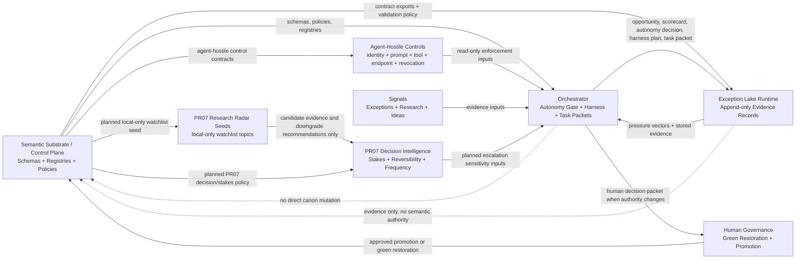
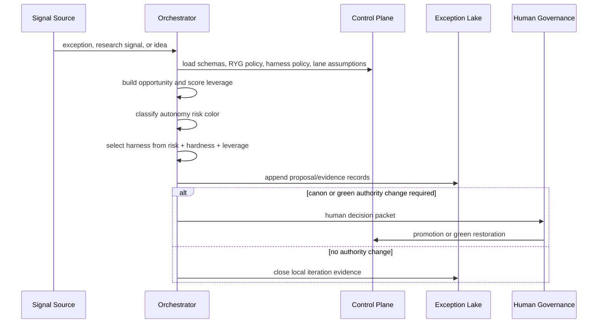

# Data Flow Map

## Summary

This repo is the LawFirm OS control-plane authority surface. It owns Phase 2 schemas, registries, red/yellow/green policy, harness policy, green-lane assumptions, and promotion boundaries.

Canonical machine name: `LawFirm-os-semantic-substrate`. Sibling runtime repos (`LawFirm-os-orchestrator` execution plane and `exceptions-lake-runtime-main` evidence plane) and authority order across repos are defined in `governance/CROSS_REPO_MAP.md`.

Runtime repos consume these contracts. They do not mutate canon.

Agent-hostile control contracts now live in the control plane as canonical schemas, registries, and governance. The Orchestrator may enforce agent identity, prompt integrity, tool authority, endpoint authority, and revocation gates, but the meaning and registry surfaces are owned here.

PR07 roadmap extension: decision intelligence will add stakes profiles, reversibility scoring, decision escalation records, and local-only Research Radar watchlists/briefs. These outputs remain candidate evidence and decision support only. Research Radar may recommend green-to-yellow or green-to-red downgrades, but may not restore green or promote canon.

Initial PR07 watchlist seed set: `research-radar-frontier-ai-001` tracks frontier AI capability signals, and the roadmap reserves related topics for math breakthroughs, agent failures, prompt injection, legal AI ethics, model policy changes, harness design, RAG quality, orchestration patterns, decision science, creativity with AI, law-firm reputation risk, and billing/carrier changes. The set is roadmap-only until PR07 implementation.

## Pre-PR07 Draft Scaffolds (non-canonical)

These artifacts already exist in the repository and are explicitly outside Phase 2 canonical authority:

- `registry/research-radar-source-registry.json` — pre-PR07 draft source-class scaffold. Marked `non_authoritative: true` and `phase: "pre-pr07-draft"`. Metadata-only and non-authorizing. Does not authorize live crawling, scheduled jobs, model calls, external APIs, external writes, or production research automation. PR07 may later formalize, supersede, or reconcile it.
- `schema/` (singular) — legacy Phase 1 doctrinal-comparison substrate. Does not replace the canonical `schemas/` JSON Schema authority layer. Any future migration or renaming of `schema/` must be a separate compatibility-preserving cleanup PR.

`schemas/` (plural) remains the canonical machine-readable JSON Schema authority layer for Phase 2. `registry/` is the canonical discovery surface for schema and governance references.

## Current Object Flow

```text
exception-event
-> pressure-vector
-> opportunity-object
-> opportunity-scorecard
-> autonomy-decision-record
-> harness-plan
-> codex-task-packet
-> agent-review-record
-> validation-gate-record
-> scale-package-object
-> promotion-decision-object, only if canon changes
```

## Mermaid Flowchart



## Mermaid Sequence



## Data Objects Entering This Repo

- Human-approved schema and policy changes.
- Human-approved promotion decisions.
- Compatibility-preserving schema placement updates.

## Data Objects Leaving This Repo

- Phase 2 schemas.
- Phase 2 registries.
- Agent-hostile prompt, tool, endpoint, identity, and revocation control registries.
- RYG autonomy policy.
- Harness policy.
- Red-flag trigger registry.
- Assumption watch registry.

## Storage And Registries Touched

- Existing root schemas under `schemas/`.
- New grouped schemas under `schemas/autonomy/`, `schemas/harness/`, `schemas/research/`, and `schemas/innovation/`.
- Existing registry convention under `registry/`.

## Validation Gates

- JSON parsing for schemas and registries.
- Registry target path checks.
- Existing unit validation under `scripts/validation/tests/`.
- Drift check via `scripts/check_repo_drift.py`.

## Orchestrator-Facing Surfaces

Agent-hostile additions:

- `registry/agent-control-contract-export.json` - agent-hostile control contract export for identity, prompts, tools, endpoints, revocation, and bundle discovery.
- `registry/agent-hostile-control-registry.json` - canonical control bundle for agent-hostile MVP surfaces.
- `governance/AGENT_HOSTILE_CONTROL_BOUNDARY.md` - control-plane boundary for prompt/tool/endpoint/identity/revocation contracts.

The substrate publishes a canonical manifest for orchestrator consumption:

- `manifests/contract_manifest.v1.json` — required orchestrator-facing manifest. Stable keys: `manifest_id`, `manifest_version`, `policy_bundle_id`, `canonical_schema_keys`, `registry_refs`, `governance_refs`.
- `registry/orchestrator-contract-export.json` — broader contract metadata complementing the manifest.
- `governance/ORCHESTRATOR_BOUNDARY.md` — orchestrator boundary doctrine (manifest-first loading, pin-and-refresh discipline, hard prohibitions).
- `docs/ORCHESTRATION_LAYER_DATA_FLOW.md` — Mermaid flow and sequence for the execution-plane interaction with substrate and Exception Lake.

## OS Contract Spine Flow (PR-06 through PR-08)

Post-admission operating loop (synthetic/fixture paths only in MVP):

```text
Legal source (fixture)
  -> SourceRef + PassageRef (Legal Knowledge Runtime; graph-ready passage_ref_id)
  -> ClaimRef + CoverageRecord + VerificationRecord
  -> ContextBundle + ExecutionPassport (Orchestrator)
  -> EvidencePacket v2 (hash chain + stub refs)
  -> ExceptionLakeAdmissionRecord + DefectRecord (Exception Lake)
  -> SkillTrustRecord + skill QA / trust-surface diff (Skills Registry supply chain)
```

**PassageRef** (`passage-ref.v1`) anchors hashed span text to a SourceRef with locators and `canonical_status=external_source_not_canon`. It is not fixed-token chunking and does not promote external law to canon.

**SkillTrustRecord** (`skill-trust-record.v1`) attests skill package trust surfaces; `approve-skill` requires `--trust-record`. Claude/OpenAI identifiers stay in skill `provider_metadata`, not core schemas.

Validator: `python scripts/validate_architecture_object_coverage.py --workspace ..` (Substrate).

## Latest Data-Flow Change

- Date: 2026-06-30
- Changed by: Codex
- What changed: Added the intake Orchestrator/Lake packet-boundary proposal to the Substrate intake contract promotion review docket and raised the pytest wrapper floor to 3600 seconds.
- Objects added: no canonical schemas, route IDs, event classes, Lake records, or runtime objects. The added docket lane covers local `orchestrator.local.*` workflow labels and `intake_lake_admission_review_packet.v0_1` as candidate review evidence only.
- Repos affected: control-plane repo only; downstream Orchestrator and Exception Lake packet validation remain runtime-owner evidence surfaces.
- Risk color: yellow governance/registry change; human review required before treating any packet shape or workflow label as stable canon.
- Harness level: H2 local registry/governance update plus validation.
