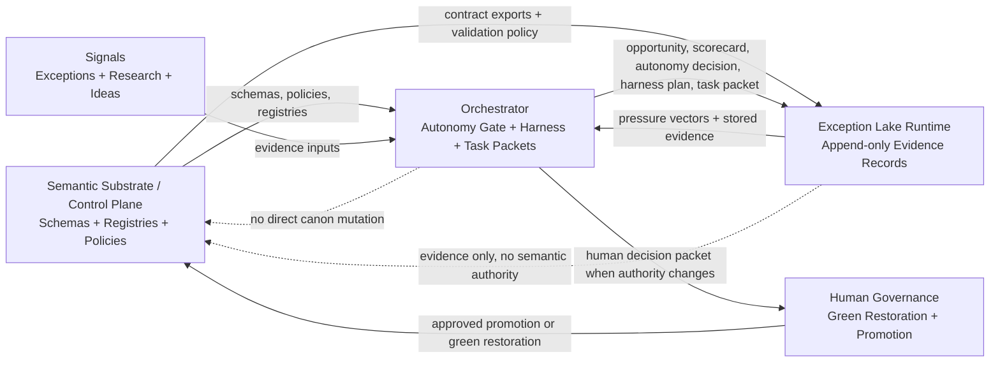
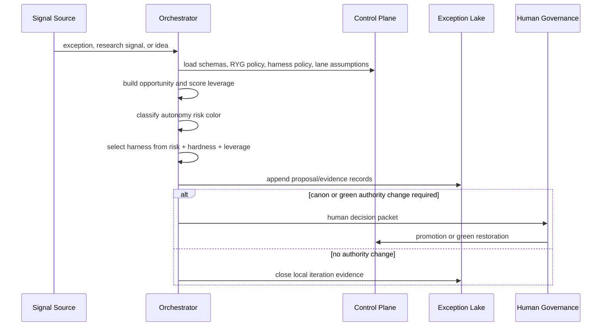

# Data Flow Map

## Summary

This repo is the LawFirm OS control-plane authority surface. It owns Phase 2 schemas, registries, red/yellow/green policy, harness policy, green-lane assumptions, and promotion boundaries.

Runtime repos consume these contracts. They do not mutate canon.

## Current Object Flow

```text
exception-event
-> pressure-vector
-> opportunity-object
-> opportunity-scorecard
-> autonomy-decision-record
-> harness-plan
-> codex-task-packet
-> agent-review-record
-> validation-gate-record
-> scale-package-object
-> promotion-decision-object, only if canon changes
```

## Mermaid Flowchart



## Mermaid Sequence



## Data Objects Entering This Repo

- Human-approved schema and policy changes.
- Human-approved promotion decisions.
- Compatibility-preserving schema placement updates.

## Data Objects Leaving This Repo

- Phase 2 schemas.
- Phase 2 registries.
- RYG autonomy policy.
- Harness policy.
- Red-flag trigger registry.
- Assumption watch registry.

## Storage And Registries Touched

- Existing root schemas under `schemas/`.
- New grouped schemas under `schemas/autonomy/`, `schemas/harness/`, `schemas/research/`, and `schemas/innovation/`.
- Existing registry convention under `registry/`.

## Validation Gates

- JSON parsing for schemas and registries.
- Registry target path checks.
- Existing unit validation under `scripts/validation/tests/`.
- Drift check via `scripts/check_repo_drift.py`.

## Latest Data-Flow Change

- Date: 2026-05-06
- Changed by: Codex
- What changed: Added Phase 2 Innovation Autonomy + Harness authority surfaces.
- Objects added: autonomy decision records, assumption watch records, harness plans, Codex task packets, research request/brief objects, incident analogies, opportunity scorecards, idea objects.
- Repos affected: control-plane repo only in PR01.
- Risk color: yellow governance/schema change; human review required before treating new authority as stable canon.
- Harness level: H2 local schema/policy update plus validation.
