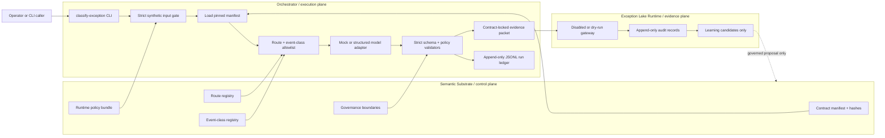
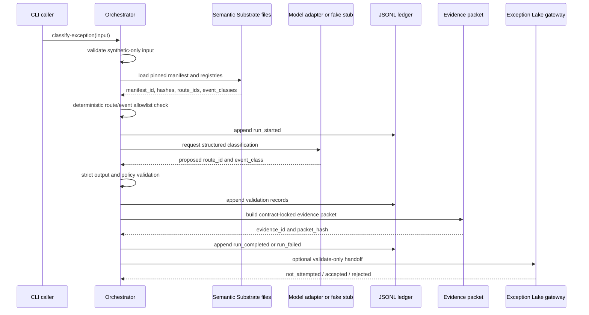

# Orchestration Layer Data Flow

Status: `draft_metadata_only`.

## Canonical names

- Substrate (control plane): `LawFirm-os-semantic-substrate`
- Orchestrator (execution plane): `LawFirm-os-orchestrator`
- Evidence Lake (evidence plane): `exceptions-lake-runtime-main`

For sibling-repo names, plane responsibilities, and authority order across repos, see `governance/CROSS_REPO_MAP.md`.

## Authoritative orchestrator-facing surfaces

The orchestrator should consume the substrate read-only through these surfaces:

- `manifests/contract_manifest.v1.json` — canonical orchestrator-facing manifest with stable keys (`manifest_id`, `manifest_version`, `policy_bundle_id`, `canonical_schema_keys`, `registry_refs`, `governance_refs`).
- `registry/orchestrator-contract-export.json` — broader contract metadata.
- `registry/exception-route-registry.json` — canonical `route_id` and `event_class` authority.
- `registry/schema-registry.json` — schema discovery surface.
- `registry/autonomy-lane-registry.json`, `registry/harness-policy-registry.json`, `registry/red-flag-trigger-registry.json`, `registry/assumption-watch-registry.json` — Phase 2 autonomy/harness authority surfaces.
- `governance/ORCHESTRATOR_BOUNDARY.md` — orchestrator boundary doctrine.

## Current MVP flow



## Sequence flow



## Evidence packet contents

```text
input artifact hash + synthetic flag
contract manifest id + hash
route/event registries and allowed IDs
model request and structured response
validation results: schema + policy + route
trace IDs: run_id, trace_id, correlation_id
source claim refs and artifact hashes
approval status and reason
optional Lake receipt or rejection
```

## Disallowed flow

```text
model output → canonical schema update
runtime pressure vector → direct substrate mutation
research paper → direct code deployment
Exception Lake candidate → automatic promotion
```

## Allowed learning loop

```text
runtime evidence
→ defect classification
→ pressure vector
→ upgrade hypothesis
→ shadow eval
→ human/proven promotion approval
→ versioned implementation
→ measured effect
```
